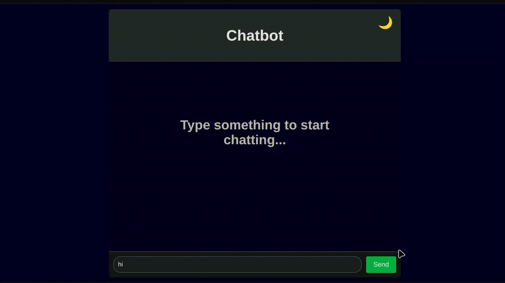

# Chatbot

## 🎥 Demo  

---

## 🤖 About the Chatbot  

This **Chatbot** is a conversational **Q/A system** built with Flask.  
It can:  
- Understand **short-form / slang words** and reply accordingly.  
- Solve **basic math problems** randomly.  
- Provide **general knowledge answers**.  

⚠️ **Note:** The dataset provided is minimal and only for demonstration purposes.  
👉 For better performance, you can **expand the dataset** with more examples.  
